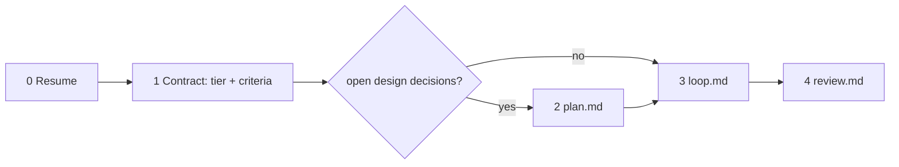

# JustSend verification contract

Deliver exactly what was asked, working end to end, proven by captured evidence.
A green test suite means a unit-level contract holds — it never proves the
user-facing behavior works. The task is done when every criterion is `surfaced`
with its artifact on disk, and not before.

The rules below are not advice. Four things enforce them in code, so write the
contract expecting to be held to it:

- `justsend_evidence` refuses GREEN with no captured RED.
- A `PreToolUse` hook refuses `justsend_work_complete` while a criterion is
  unproven, and names which ones.
- The `Stop` hook refuses a quiet end of turn for the same reason — an unproven
  contract keeps the turn alive instead of trailing off.
- The `PreToolUse` delegation guard refuses an oversized batch and refuses a
  `worker` brief without Target / Change / Acceptance.

## Phases

This file owns Phases 0-1 and the routing. Each later phase is a file you read
when its phase begins, and then follow literally.

- **Phase 2 — Plan** → `plan.md`, only when design decisions are still open.
- **Phase 3 — Execute** → `loop.md`.
- **Phase 4 — Review and complete** → `review.md`.

**Do not declare completion outside `review.md`.** The gate is there, and so is
the six-aspect review that decides whether the work is actually finished.

## Where the state lives

| What | Where | Read it with |
|---|---|---|
| Criteria, evidence, status | `.justsend/contract/<task_key>.json` | `justsend_contract_status` |
| Decisions, dead ends, blockers | the work record for the same `task_key` | `justsend_context` |

One `task_key` spans both. Choose it once — a short kebab slug of the objective
(`fix-login-race`, `settings-scroll-jitter`) — and reuse it in every call. The
record is the human-readable layer that syncs to the user's devices; the contract
file is the machine-checked one. Never duplicate contract state in prose.

## 1. Resume before you start

Run `justsend_contract_status` and `justsend_search` first. If this task already
has a contract or a record, continue it — `justsend_contract_set` and
`justsend_work_start` are both find-or-update on `task_key`, so re-registering is
safe and never forks a second one.

A compaction hook re-injects the contract summary, so after any context loss call
`justsend_contract_status` and resume from the unproven list instead of guessing
what you had already proven.

If a note or record you are sure you wrote is not there, call `justsend_health`
before concluding anything. "My writes are queued and the app has not applied
them" and "I am reading a different account" produce the identical symptom — a
missing record — and only one of them means you have work to redo. It answers
both: `account_id`, `queue` counts (`pending`, `retrying`, `blocked`, `failed`),
and `last_applied_at`.

## 2. Triage the tier once

Judge by what this session will itself edit or execute. Delegated work is payload
and does not raise your tier.

- **LIGHT** (default) — a known pattern with no open design decisions: a one-spot
  bug fix, an endpoint following an existing pattern, a validation rule, a query
  tweak, copy or constants.
- **HEAVY** — any one of these forces it: a new module, layer, domain model, or
  abstraction; auth, security, session, or permission code; building or changing
  an external integration; a schema change or migration; concurrency, transaction
  boundaries, or cache invalidation; a refactor crossing domain boundaries; or
  the user asked for care ("carefully", "thoroughly", "design first").

When unsure, take HEAVY. If a HEAVY fact surfaces mid-task, upgrade immediately
and redo whatever LIGHT skipped. Never downgrade.

## 3. Register the contract

`justsend_contract_set(task_key, objective, tier, criteria)`. Each criterion is
`{id?, scenario, observable, proof?}`:

- **`scenario`** — the literal command, page action, or payload. Not a topic:
  `curl -XPOST /api/login -d '{"pw":""}'`, not "test empty password".
- **`observable`** — the single binary observation that decides PASS or FAIL.
  `HTTP 400 with code=EMPTY_PASSWORD`, not "handles it correctly".
- **`proof`** — `red-green` (default, failing-first enforced) or `review` for
  prose with no machine consumer. `review` criteria go straight to `surface`.

LIGHT takes 1–2 criteria: the happy path and the riskiest edge. HEAVY takes 3 or
more: the happy path, the edges that actually break (boundary, empty, malformed,
concurrent), and one adjacent-surface regression named by file and function.

Open the work record in the same breath: `justsend_work_start(task_key, task)`.

## 4. Route

- Design decisions still open — unclear boundaries, several viable
  decompositions, non-obvious dependency order → read `plan.md`.
- Ready to build → read `loop.md`. It owns the per-criterion loop
  (RED → GREEN → SURFACE → CLEAN), the surface-channel table, the prose-target
  rule, cleanup receipts, delegation, and fix-list intake.
- Every criterion proven → read `review.md`. It owns the gate, the six review
  aspects, the clean cutover, and closing the record.

Each file ends by pointing at the next. Completion is declared in `review.md` and
nowhere else.

## Tool routing

| You need to | Call |
|---|---|
| Register or update the criteria | `justsend_contract_set` |
| Record RED / GREEN / SURFACE / cleanup | `justsend_evidence` |
| See what is still unproven | `justsend_contract_status` |
| Open or resume the work record | `justsend_work_start` |
| Log a decision, a dead end, or a blocker | `justsend_work_note` |
| Finish (gated) | `justsend_work_complete` |
| Append as a delegated agent | `justsend_progress_note` |
| Recover state after compaction | `justsend_contract_status`, `justsend_context` |
| Tell a queued write apart from a wrong account | `justsend_health` |
| Park unproven work, or pick it up again | `justsend_work_status` (`backlog` / `in-progress`) — moves the record without a note, and is **not** a close: `justsend_work_complete` stays the gated exit |
