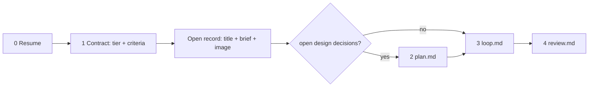

# JustSend work records

A work record is a memo in the user's own JustSend library — they read and edit it
in the app like any other note, and it syncs to their phone. Notes accumulate
under it in time order. That is the whole storage model: no board, no sprint, no
separate agent log.

One `task_key` spans everything below. Choose it once — a short kebab slug of the
objective (`fix-login-race`, `settings-scroll-jitter`) — and reuse it in every
call. `justsend_work_start` and `justsend_contract_set` are both find-or-update on
it, so re-registering is safe and never forks a second one.

## The record

- **Validate every MCP call.** Before the first use of an MCP tool, read its
  current schema and include every required argument. `Invalid args` or a
  schema-validation error means the tool did not run and produced no evidence.
  Correct the payload and retry immediately; do not advance dependent research,
  plans, todos, or verification criteria until the corrected call succeeds.
- **Bind it to the repository.** Pass `project` with the repo name (the working
  directory basename) on `justsend_work_start`; it becomes the tag that answers
  "what work exists for this repo" later. Pass `work_id` instead when the task
  carries an issue number (`IOSPROD-202`) — the number goes to the front of the
  title and the project tag is derived from it.
- **Read before you write.** Search for prior work with `justsend_search`, using a
  concise query derived from the objective, stable `task_key` or work id, and
  distinctive domain terms. Always pass `including_agent: true` because prior work
  records are agent-created; without it a plain call can return `[]` while matching
  work exists. Use `limit: 5`. When the tool schema advertises it, also pass
  `strategy: "resume"`; the server searches identity, current state, then history
  without returning every body. Older servers get the same query and flags without
  `strategy`. Use `justsend_get_record(work_id:)` when
  the exact work id is known. Do not use a newest-first list as a substitute for
  relevance search. If a record for this task exists, continue it.
- **Resume from the record, not from memory.** After a break or a compaction,
  `justsend_context` returns the current state.
- **Notes carry what a diff cannot** — decisions, the reason behind them, and dead
  ends. A log of successes alone sends the next reader into the trap you escaped.
  `blocker: true` when a human has to act; that also stands the gate down.
- **Close with evidence.** `justsend_work_complete` appends the outcome,
  verification, failures and what is still open as the final audit note.
- **Progress appends do not control lifecycle.** `justsend_progress_note` adds a
  note to an existing `task_key` and `item_id`; it never starts, completes,
  retracts, or mutates the verification contract.
- **Never put a secret in a note.** Records sync to the user's other devices.
- **A denial is a setting, not a bug.** Reading and appending are separate toggles
  in JustSend → Settings → Agent access. If a tool answers "access is disabled",
  name the toggle instead of retrying.

Writes are queued and applied by the app; `justsend_work_start` still returns
`item_id` immediately, so notes and completion can follow at once. Do not poll.
`pending` is normal, `retrying` usually means the app is signed out, and `blocked`
needs the user. In `justsend_health`, those are current queue states; `failed` is
cumulative terminal history, not pending work. A failed intent will never retry and
is never a healthy result: report the returned error, fix its cause, and do not
claim that intent succeeded. Separate the current queue from cumulative failures
when reporting overall health. When a write seems missing, `justsend_health`
separates "queued" from "reading a different account"; they look identical from
the outside.

`justsend_search(strategy: "resume")` is the default discovery path when supported:
`identity` checks title/task key, `current` combines agent `work_status` with the
latest applied update (ordinary records use their item body), and `history` adds
note annotations. `resolved_scope` and `match_source` say what answered. The user's
memo `status` is never an agent current-state signal. Search never means "all
records." Reserve `justsend_list_records` for an explicit inventory by tag, status,
kind, or newest-first order. Its `limit` returns only the leading slice, so never
describe that slice as the whole library. Both tools exclude agent records by
default; pass `including_agent: true` when agent work belongs in the result. State
the query or filters and `limit` when describing the scope.

Two unrelated status axes exist. `status` is the user's own memo column and reads
`pending` on every agent-created record — leave it alone. Your calls write
`work_status` (`backlog`, `todo`, `in-progress`, `done`, `canceled`), each stamp
replacing the last. `justsend_work_status` moves a record without writing a note,
which is right for deferring and is never a close.

## Writing it so both readers get it

The person reads on a phone; a later session resumes after compaction from the
same document.

- **`work_start` takes separate `title` and `body`.** Write `title` as
  `<type>: <subject>` — type from `fix`, `feature`, `investigation`, `migration`,
  `method`, `review`, subject in a few words. The applier prepends the work id, so
  it becomes `IOSPROD-12 fix: 로그인 이중 갱신`. Pass the same type word to
  `justsend_contract_set(type:)` so the generated report title matches the record.
  Never repeat the title by deriving it from the first body line.
- **The start `body` is a brief, not a result.** Start it at `##` and write, in the
  reader's language: one plain-language lede, scope or method, and the registered
  success criteria. These are all facts available before execution. Do not invent
  results or failures at start time.
- **Draw the representative image before the first `work_start`.** Pass its PNG
  or JPEG as `image_path` for every new task. The helper only attaches it while
  creating the record; a resumed start returns `image_status: ignored_existing_record`
  and does not change the existing body or image. Do not delay this one chance.
- **Completion is the audit note, not a body rewrite.** Pass `summary` to
  `justsend_work_complete`: outcome, the evidence that decides it, then what
  failed and what it taught. Say "none" for the last rather than dropping it.
  The structured start `body` remains the readable brief; completion accumulates
  below it as the verified work history.
- **`image_path` is for a drawing, not for text set large.** eli5 in one line:
  *big picture, very few words, for someone who knows nothing about it.* The
  picture has to carry the mechanism — what moves where, and where it stops. Do
  not also write a Markdown image reference; the app already renders the attached
  hero above the body and uses it as the row thumbnail.
- **Paste the table, do not hand-assemble it.**
  `justsend_contract_status(format: "report")` emits one bounded row per criterion
  with a wordless header because the plugin does not know the reader's language.
  Add the surrounding heading in that language and put the generated table in the
  completion `summary`; keep raw evidence paths out of the start brief because a
  phone cannot open them.
- **A path is not a citation.** `~/.justsend/evidence/red.log` cannot be opened on
  a phone. Quote the line of output that decides the claim, and prefer an `https`
  URL. If an artifact is wrong, capture a new path rather than overwriting one
  already recorded.
- **Four constructs do not survive the renderer.** There is no frontmatter parser,
  GitHub alerts, footnotes, or math renderer. What does draw: headings from `##`,
  checklists, fenced code, ` ```mermaid `, and tables. Tables degrade to source
  text on macOS 12 / iOS 15 and earlier.
- **Do not chain inline code in a sentence.** Name one path inline, or put several
  in a table. A diagram earns its space only when the flow itself moved.

## The contract

Deliver exactly what was asked, working end to end, proven by captured evidence. A
green test suite means a unit-level contract holds; it never proves the
user-facing behavior works. Four things enforce this in code, so write the
contract expecting to be held to it:

- `justsend_evidence` refuses GREEN with no captured RED. Each accepted artifact is
  copied to a content-addressed, read-only SHA-256 snapshot the plugin never
  overwrites; its original path is context, not the proof identity.
- A `PreToolUse` hook refuses `justsend_work_complete` while a criterion is
  unproven, and names which ones.
- The `Stop` hook refuses a quiet end of turn for the same reason.
- A `justsend_work_note` with `blocker: true` stamps `blocked_at`, which stands
  both of those down until the next `justsend_evidence` clears it.

**Triage the tier once**, by the changes and executions this record covers.
**LIGHT** is a known pattern with no open design decisions. **HEAVY** is forced
by any of: a new module, layer or
abstraction; auth, security, session or permission code; an external integration;
a schema change or migration; concurrency, transaction boundaries or cache
invalidation; a refactor crossing domain boundaries; or the user asking for care.
When unsure, take HEAVY. Upgrade mid-task if a HEAVY fact surfaces; never
downgrade.

**Register it.** `justsend_contract_set(task_key, objective, tier, criteria)`,
each criterion `{id?, scenario, observable, proof?}`:

- `scenario` — the literal command, page action, or payload, not a topic.
- `observable` — the one binary observation that decides PASS or FAIL.
- `proof` — `red-green` (default, failing-first enforced) or `review` for prose
  with no machine consumer, which goes straight to `surface`.

LIGHT takes 1–2 criteria: the happy path and the riskiest edge. HEAVY takes 3 or
more, including one adjacent-surface regression named by file and function.

**Status has one source.** `justsend_contract_status` owns which criteria are
proven — never restate it in prose. The criteria's *definitions* belong in the
record body once, at registration. The closing summary is the one place the whole
thing is written down again, because `.justsend/` need not be committed and the
record is what reaches the user's phone.

## Phases



Resume first: `justsend_contract_status` and `justsend_search`. Then register the
criteria, open the record with separate `title` and brief `body`, and route —
`plan.md` only when design decisions are still open, `loop.md` to build,
`review.md` to finish. Each file is read when its phase begins and followed
literally. **Completion is declared in `review.md` and nowhere else.**

## Tool routing

| You need to | Call |
|---|---|
| Open or resume the record | `justsend_work_start` (`task_key`, `title`, brief `body`, plus `project` or `work_id`; `image_path` on the first call) |
| Register or update the criteria | `justsend_contract_set` |
| Record RED / GREEN / SURFACE / cleanup | `justsend_evidence` |
| See what is unproven | `justsend_contract_status` |
| Get the readable artifact to paste | `justsend_contract_status` (`format: "report"`) |
| Log a decision, a dead end, or a blocker | `justsend_work_note` (`blocker`) |
| Finish with the audit note (gated) | `justsend_work_complete` (`summary`) |
| Append progress to an existing record | `justsend_progress_note` |
| Park work, or pick it up again | `justsend_work_status` (`backlog` / `in-progress`) |
| Undo a record created wrongly | `justsend_work_retract` |
| Recover after a compaction | `justsend_contract_status`, `justsend_context` |
| Tell a queued write from a wrong account | `justsend_health` |
| Survey what exists | `justsend_list_records`, `justsend_search`, `justsend_list_notes`, `justsend_list_tags` |

This skill never deletes or rewrites the user's own content: there is no tool for
it, and `justsend_work_retract` reaches only records carrying your own anchor.
Never work around that by editing the database directly.
