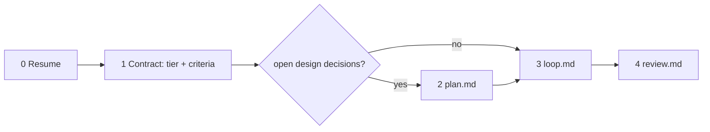

# JustSend work records

A work record is a memo in the user's own JustSend library — they read and edit it
in the app like any other note, and it syncs to their phone. Notes accumulate
under it in time order. That is the whole storage model: no board, no sprint, no
separate agent log.

One `task_key` spans everything below. Choose it once — a short kebab slug of the
objective (`fix-login-race`, `settings-scroll-jitter`) — and reuse it in every
call. `justsend_work_start` and `justsend_contract_set` are both find-or-update on
it, so re-registering is safe and never forks a second one.

## The record

- **Bind it to the repository.** Pass `project` with the repo name (the working
  directory basename) on `justsend_work_start`; it becomes the tag that answers
  "what work exists for this repo" later. Pass `work_id` instead when the task
  carries an issue number (`IOSPROD-202`) — the number goes to the front of the
  title and the project tag is derived from it.
- **Read before you write.** `justsend_list_records` and `justsend_search` drop
  every agent-created record unless you pass `including_agent: true`, so a plain
  call returns `[]` even when hundreds exist and reads as "no prior work".
  `justsend_get_record(work_id:)` has no such filter. If a record for this task
  exists, continue it.
- **Resume from the record, not from memory.** After a break or a compaction,
  `justsend_context` returns the current state.
- **Notes carry what a diff cannot** — decisions, the reason behind them, and dead
  ends. A log of successes alone sends the next reader into the trap you escaped.
  `blocker: true` when a human has to act; that also stands the gate down.
- **Close with evidence.** `justsend_work_complete` takes the outcome, how it was
  verified, and what is still open.
- **Delegated work appends.** A subagent gets `task_key` and `item_id` and uses
  `justsend_progress_note` only. Starting, completing, retracting, and every
  contract call belong to the parent.
- **Never put a secret in a note.** Records sync to the user's other devices.
- **A denial is a setting, not a bug.** Reading and appending are separate toggles
  in JustSend → Settings → Agent access. If a tool answers "access is disabled",
  name the toggle instead of retrying.

Writes are queued and applied by the app; `justsend_work_start` still returns
`item_id` immediately, so notes and completion can follow at once. Do not poll.
`pending` is normal, `retrying` usually means the app is signed out, `blocked`
needs the user, `failed` is permanent — report it rather than rewriting from
memory. When a write seems missing, `justsend_health` separates "queued" from
"reading a different account"; they look identical from the outside.

Two unrelated status axes exist. `status` is the user's own memo column and reads
`pending` on every agent-created record — leave it alone. Your calls write
`work_status` (`backlog`, `todo`, `in-progress`, `done`, `canceled`), each stamp
replacing the last. `justsend_work_status` moves a record without writing a note,
which is right for deferring and is never a close.

## Writing it so both readers get it

The person reads on a phone; the next agent reads after a compaction. Same
document.

- **The title is the first line of `work_start(task:)`.** Write it
  `<type>: <subject>` — type from `fix`, `feature`, `investigation`, `migration`,
  `method`, `review`, subject in a few words. The applier prepends the work id, so
  the line becomes `IOSPROD-12 fix: 로그인 이중 갱신`. Both halves are fold keys: saved
  searches are text queries over a trigram index, so one search collects a project
  and another collects every `fix` in it. Pass the same word as
  `justsend_contract_set(type:)` and the report's first line is this title.
- **Lead in plain language**, one sentence, before any evidence. A record that
  opens with a wall of fenced output is one the user scrolls past and the next
  agent has to read in full to find the line that mattered.
- **Three parts, in the reader's language**: the one-line summary, the result
  table, then what failed and what it taught. Say "none" for the last rather than
  dropping it.
- **No `#` on that first line.** It is already the largest type on both surfaces,
  so the marker only reaches the reader as literal `##` next to the work id.
- **Every task record opens with a picture. Always pass `image_path`.** Not when
  it seems useful — every time you open a record for new work. One record is one
  task, and the picture is what makes that row answerable on a phone list where
  every other row is text.

  **You get one chance.** The tool honours `image_path` only while it *creates*
  the record. Call `justsend_work_start` again on the same `task_key` with an
  image and it returns `materialized: true` and attaches nothing — the record
  then has no picture until it is retracted and rebuilt. So draw it before the
  first call, not after you notice it is missing.

  Notes are exempt: a comment on the task does not get its own hero.
- **`image_path` is for a drawing, not for text set large.** eli5 in one line:
  *big picture, very few words, for someone who knows nothing about it.* The
  picture has to carry the mechanism — what moves where, and where it stops. A
  sentence or a count rendered at 300px explains nothing the body did not already
  say, and it is neither searchable nor translated. If a table or a ```mermaid
  fence can carry it, use those instead; the image is for what they cannot draw.
- **Paste the table, do not hand-assemble it.**
  `justsend_contract_status(format: "report")` emits the type line and one bounded
  row per criterion — `| c1 | ✅ | the observable |` — with an empty header row,
  because the app ships in sixteen languages and the plugin must not put a word in
  front of the reader. **You** write the headings and the prose around it, in the
  language you are already speaking.
- **A path is not a citation.** `~/.justsend/evidence/red.log` cannot be opened on
  a phone — the app renders a link but nothing follows it. Quote the line of
  output that decides the claim, and prefer an `https` URL. Never write a path you
  did not capture; if an artifact is wrong, capture a new one under a new path
  rather than overwriting the recorded one.
- **Four constructs do not survive the renderer.** There is no frontmatter parser,
  so a leading `---` block draws as a horizontal rule followed by a large heading
  reading `type: …`. `> [!NOTE]` draws as a plain quote whose first line reads
  `[!NOTE]`. `[^footnote]` and `$math$` print as those literal characters. What
  does draw: `- [ ]`, fenced code, ` ```mermaid `, and tables — tables on
  macOS 13 / iOS 16 and later only, so a table is the one construct that degrades
  to source text on an old OS. Start a body at `##`.
- **Do not chain inline code in a sentence.** Three file names joined by
  separators render as one monospace run and break mid-identifier on a phone
  (observed: `MCPToolDispatch.sw ift`). Name one path inline, or put several in a
  table.
- Structure belongs in the record body, written once — every note ships in full on
  every sync. A diagram earns its space only when the flow itself moved.

## The contract

Deliver exactly what was asked, working end to end, proven by captured evidence. A
green test suite means a unit-level contract holds; it never proves the
user-facing behavior works. Five things enforce this in code, so write the
contract expecting to be held to it:

- `justsend_evidence` refuses GREEN with no captured RED.
- A `PreToolUse` hook refuses `justsend_work_complete` while a criterion is
  unproven, and names which ones.
- The `Stop` hook refuses a quiet end of turn for the same reason.
- A `justsend_work_note` with `blocker: true` stamps `blocked_at`, which stands
  both of those down until the next `justsend_evidence` clears it.
- The delegation guard refuses an oversized batch and a `worker` brief without
  Target / Change / Acceptance.

**Triage the tier once**, by what this session will itself edit or execute;
delegated work is payload and does not raise it. **LIGHT** is a known pattern with
no open design decisions. **HEAVY** is forced by any of: a new module, layer or
abstraction; auth, security, session or permission code; an external integration;
a schema change or migration; concurrency, transaction boundaries or cache
invalidation; a refactor crossing domain boundaries; or the user asking for care.
When unsure, take HEAVY. Upgrade mid-task if a HEAVY fact surfaces; never
downgrade.

**Register it.** `justsend_contract_set(task_key, objective, tier, criteria)`,
each criterion `{id?, scenario, observable, proof?}`:

- `scenario` — the literal command, page action, or payload, not a topic.
- `observable` — the one binary observation that decides PASS or FAIL.
- `proof` — `red-green` (default, failing-first enforced) or `review` for prose
  with no machine consumer, which goes straight to `surface`.

LIGHT takes 1–2 criteria: the happy path and the riskiest edge. HEAVY takes 3 or
more, including one adjacent-surface regression named by file and function.

**Status has one source.** `justsend_contract_status` owns which criteria are
proven — never restate it in prose. The criteria's *definitions* belong in the
record body once, at registration. The closing summary is the one place the whole
thing is written down again, because `.justsend/` need not be committed and the
record is what reaches the user's phone.

## Phases



Resume first: `justsend_contract_status` and `justsend_search`. Then register, then
route — `plan.md` only when design decisions are still open, `loop.md` to build,
`review.md` to finish. Each file is read when its phase begins and followed
literally. **Completion is declared in `review.md` and nowhere else.**

## Tool routing

| You need to | Call |
|---|---|
| Open or resume the record | `justsend_work_start` (`task_key`, `task`, plus `project` or `work_id`) |
| Register or update the criteria | `justsend_contract_set` |
| Record RED / GREEN / SURFACE / cleanup | `justsend_evidence` |
| See what is unproven | `justsend_contract_status` |
| Get the readable artifact to paste | `justsend_contract_status` (`format: "report"`) |
| Log a decision, a dead end, or a blocker | `justsend_work_note` (`blocker`) |
| Finish (gated) | `justsend_work_complete` |
| Append as a delegated agent | `justsend_progress_note` |
| Park work, or pick it up again | `justsend_work_status` (`backlog` / `in-progress`) |
| Undo a record created wrongly | `justsend_work_retract` |
| Recover after a compaction | `justsend_contract_status`, `justsend_context` |
| Tell a queued write from a wrong account | `justsend_health` |
| Survey what exists | `justsend_list_records`, `justsend_search`, `justsend_list_notes`, `justsend_list_tags` |

This skill never deletes or rewrites the user's own content: there is no tool for
it, and `justsend_work_retract` reaches only records carrying your own anchor.
Never work around that by editing the database directly.
